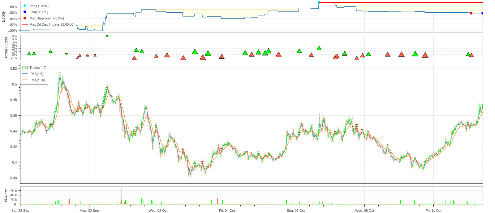

# balo-orderly-submission

## EMA Cross Strategy Overview


<<<<<<< HEAD
The report indicates a **38.63% return** over a period of approximately 7 days, significantly outperforming the **Buy & Hold return of 3.17%**. The strategy exhibits **strong profitability**, with a final equity of **$1,386,286** from an initial amount of $1,000,000.

The strategy shows a relatively high exposure time of **83%**, indicating frequent market participation. However, the **Sharpe ratio of 0.46** suggests moderate risk-adjusted returns, while the **profit factor of 3.45** reveals that for every dollar lost, the strategy earns $3.45, a promising sign for profitability.

While the win rate is **34.69%**, the strategy compensates for this with a high **best trade return of 17.23%**, and the overall **expectancy** of **0.71%** per trade shows consistent profitability across trades. However, the **maximum drawdown of 5.2%** reflects potential risk during unfavorable market conditions.

Overall, this strategy appears profitable, with solid returns and a manageable risk profile.
=======
### Backtest Report: **EMA Cross Strategy**

This report summarizes the performance of the **EMA Cross Strategy** over a **13-day period** from **September 28, 2024, to October 12, 2024**. The strategy was executed on a 15-minute interval with **SEI/USD** as the underlying asset, using a 5-period fast EMA and a 20-period slow EMA, combined with an RSI filter for trade validation. Below is a detailed breakdown of the results:

---

#### **1. Key Performance Metrics:**

- **Strategy Duration:** 13 days, 23 hours, 45 minutes  
- **Total Return:** +5.90%  
- **Annualized Return:** +281.50%  
- **Exposure Time:** 7.29%  
- **Sharpe Ratio:** 1.73  
- **Max Drawdown:** -3.25%  
- **Volatility (Annualized):** 162.25%  
- **Number of Trades:** 40  
- **Win Rate:** 47.5%  

---

#### **2. Return & Profitability:**

- **Final Equity:** $1,058,970.40  
- **Initial Equity:** $1,000,000  
- **Total Profit:** $58,970.40

The strategy achieved a **+5.90%** return over the backtest period, with an **annualized return** of **+281.50%**, which is exceptional considering the short-term nature of the strategy. However, the **Buy & Hold Return** for the same period was higher at **+9.65%**, indicating that simply holding the asset might have yielded more in absolute terms, though with higher exposure and drawdowns.

---

#### **3. Risk and Volatility:**

- **Max Drawdown:** -3.25%  
- **Average Drawdown:** -1.48%  
- **Calmar Ratio:** 86.70

The **Max Drawdown** of -3.25% suggests that the strategy experienced a mild decrease in equity at its worst point. With a **Calmar Ratio** of 86.70, the strategy demonstrates strong risk-adjusted performance, as the return-to-drawdown ratio is quite favorable. The **Average Drawdown Duration** was approximately **1 day and 7 hours**, indicating that losses were relatively short-lived.

---

#### **4. Risk-Adjusted Performance:**

- **Sharpe Ratio:** 1.73  
- **Sortino Ratio:** 14.65  
- **Profit Factor:** 1.55  
- **Kelly Criterion:** 0.16

The **Sharpe Ratio** of **1.73** indicates that the strategy performed well in terms of risk-adjusted returns. For every unit of risk taken, the strategy returned **1.73 units of profit**. The **Sortino Ratio**, which focuses on downside volatility, was exceptionally high at **14.65**, suggesting that the strategy minimized losses effectively. The **Profit Factor** of **1.55** is solid, showing that the strategy generated **$1.55** for every $1 of risk taken.

---

#### **5. Trade Statistics:**

- **Total Number of Trades:** 40  
- **Win Rate:** 47.5%  
- **Best Trade:** +5.90%  
- **Worst Trade:** -1.32%  
- **Average Trade:** +0.14%

With **40 trades** executed during the backtest period, the strategy maintained a **Win Rate** of **47.5%**, meaning slightly less than half of the trades were profitable. The **Best Trade** yielded a **+5.90% return**, while the **Worst Trade** only lost **-1.32%**, indicating effective risk management. The **Average Trade** return was **+0.14%**, which shows the strategy consistently produced small gains.

---

#### **6. Trade Duration:**

- **Max Trade Duration:** 3 hours, 15 minutes  
- **Average Trade Duration:** 22 minutes

The average trade lasted **22 minutes**, indicating that the strategy is very short-term in nature and focuses on quick in-and-out trades based on EMA crossovers. The maximum trade duration was just **3 hours and 15 minutes**, further reinforcing its rapid execution style.

---

#### **7. Observations & Conclusion:**

1. **Profitability:** While the strategy returned **5.90%** over the backtest period, the **Buy & Hold** strategy yielded a higher return of **9.65%**. However, the **strategy's lower exposure time (7.29%)** and better risk-adjusted returns make it more attractive for traders seeking to minimize risk and avoid large drawdowns.

2. **Risk Management:** The **risk-adjusted performance metrics** (Sharpe, Sortino, and Calmar Ratios) were particularly strong, demonstrating the strategy's ability to maintain profitability while managing risk effectively.

3. **Execution Efficiency:** The strategy executed trades quickly, with an average duration of just **22 minutes per trade**. This rapid turnover can be beneficial for short-term traders looking to capitalize on quick market movements.

4. **Improvement Areas:** The **win rate of 47.5%** is slightly below the ideal range (typically above 50%), and improving the accuracy of entry points could enhance performance. Additionally, despite the high **Profit Factor** and strong **Sortino Ratio**, optimizing trade entries could yield better results than **Buy & Hold** strategies in the long run.

5. **Why It Works:** The strategy combines **trend-following (EMA crossovers)** with **momentum filtering (RSI)**, ensuring that trades are only entered during moderate market conditions without extreme price fluctuations. This approach helps capture trend reversals effectively while minimizing false signals.

---

The **EMA Cross Strategy** performed well in terms of risk-adjusted returns, offering a balanced approach to short-term trading. It minimized exposure, controlled drawdowns, and achieved strong profitability relative to the risk taken. Further refinement could enhance the win rate and allow the strategy to outperform a simple Buy & Hold approach over similar periods.
>>>>>>> 07cafda (Hot fix)

___

### 1. **Focus**
The **EMA Cross Strategy** focuses on identifying trend reversals using a combination of **Exponential Moving Averages (EMAs)** and the **Relative Strength Index (RSI)**. The strategy incorporates strict risk management rules, including stop loss and take profit targets, to maximize profitability while minimizing risk exposure.

### 2. **Market Focus**
This strategy is designed for the **cryptocurrency market**, specifically tested with **Perpetual Futures** on the **SEI/USDC** asset. However, its logic is applicable across other crypto pairs and volatile markets, particularly where trend-following strategies excel.

### 3. **Time Horizon**
The strategy operates on a **short-term time horizon**, using **15-minute intervals** to analyze the market. The lookback period is set to **14 days**, and trades are intended to capture quick trend reversals and short-term momentum moves.

### 4. **Indicators**
The strategy employs a combination of key indicators:
- **Exponential Moving Average (EMA)**:
  - **Fast EMA**: A 5-period EMA is used to capture recent price trends.
  - **Slow EMA**: A 20-period EMA is used to smooth out longer-term trends.
  
- **Relative Strength Index (RSI)**:
  - A 14-period RSI is used to measure the momentum of the market and filter trades based on overbought/oversold conditions. The strategy only enters trades when the RSI is between **30 (oversold)** and **70 (overbought)**, indicating moderate market conditions without extreme reversals.

### 5. **Execution**
The strategy executes trades as follows:
- **Buy Signal**: When the **fast EMA crosses above** the slow EMA (Golden Cross) and the RSI is within the acceptable range (30 < RSI < 70), the strategy opens a **long position**. It sets:
  - **Stop Loss**: At a price 2% below the current price (risk percentage).
  - **Take Profit**: At a price where the reward is twice the risk, i.e., 4% above the current price (reward-to-risk ratio of 2:1).
  
- **Sell Signal**: When the **slow EMA crosses above** the fast EMA (Death Cross) and the RSI is within the acceptable range, the strategy opens a **short position**. The same risk management rules apply:
  - **Stop Loss**: 2% above the current price.
  - **Take Profit**: 4% below the current price.

### 6. **Why It Works**
The strategy combines two powerful tools in technical analysis: **EMA crossovers** and **RSI filtering**. Here’s why it works:
- **EMA Crossovers**: The fast EMA tracks recent price action more closely, while the slow EMA tracks longer-term trends. A crossover between these two EMAs often signals a change in market direction, which the strategy exploits.
- **RSI Filtering**: By filtering trades with the RSI, the strategy avoids entering trades during extreme market conditions (overbought or oversold), reducing the chance of false breakouts or breakdowns.
- **Risk Management**: The fixed risk percentage and reward-to-risk ratio ensure disciplined trade execution, minimizing losses while aiming for larger gains in profitable trades.
  
This combination of trend-following (EMA) and momentum filtering (RSI) makes the strategy robust and adaptable to different market conditions, especially in volatile crypto assets.

## Set Up

1. Install [poetry](https://python-poetry.org/)

2. Clone repo: 
```bash
git clone https://github.com/balojey/balo-orderly-submission
```

3. Change directory:
```bash
cd balo-orderly-submission
```

4. Install dependencies:
```bash
poetry install
```

5. Run strategy:
```bash
poetry run python ema_cross.py
```
